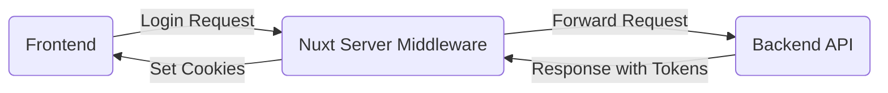

<!--
Get your module up and running quickly.

Find and replace all on all files (CMD+SHIFT+F):
- Name: My Module
- Package name: my-module
- Description: My new Nuxt module
-->

# Nuxt Authentication

[npm version][npm-version-href]
[npm downloads][npm-downloads-href]
[License][license-href]
[Nuxt][nuxt-href]

Nuxt Authentication is a simple module that proposes authentication functionalities for Nuxt applications that uses backends like Django REST framework or Laravel Sanctum.

- [✨ &nbsp;Release Notes](/CHANGELOG.md)

<!-- - [🏀 Online playground](https://stackblitz.com/github/your-org/my-module?file=playground%2Fapp.vue) -->

<!-- - [📖  Documentation](https://example.com) -->

## Features

<!-- Highlight some of the features your module provide here -->

- ⛰ &nbsp;Login / Logout
- 🚠 &nbsp;Check Authentication Status
- 🌲 &nbsp;Fetch User Profile

## Quick Setup

Install the module to your Nuxt application with one command:

```bash
npx nuxi module add nuxt-authentication
```

Then add the `useNuxtAuthentication` composable to your `app.vue` file to ensure that the `isAuthenticated` global state is populated on app load:

```vue
<script lang="ts" setup>
const { hasToken, isAuthenticated } = useNuxtAuthentication()
</script>
```

That's it! You can now use Nuxt Authentication in your Nuxt app ✨

## Architecture

Nuxt Authentication uses the BFF (Backend for Frontend) pattern to handle authentication. The Nuxt server middleware acts as a proxy between the frontend and the backend, allowing for secure communication and token management.

This ensures that the tokens are not exposed to the frontend, and the authentication process is handled securely on the server side.



## Composables

### Checking for tokens

The `useNuxtAuthentication` composable can be used to check for the presence of authentication tokens:

```vue
<script lang="ts" setup>
const { hasToken, isAuthenticated } = useNuxtAuthentication()
</script>
```

> [!NOTE]
> The `hasToken` property indicates only if there is an access token present, while the cookie
> The `isAuthenticated` property indicates whether the user is authenticated based on the success or result of the authentication process.
> The presence of a token does not necessarily mean that the user is authenticated, as the token could be expired or invalid.

### Verifying the access token

You can verify the authenticity of a user's access token with the `verify` function:

```vue
<script lang="ts" setup>
const { verify } = useNuxtAuthentication()
</script>
```

A failed verification will trigger the user-not-authenticated workflow based on the strategy set in the module options. The default strategy is `renew`, which will attempt to refresh the access token using the refresh token.

### Refreshing a token

An access token can be refreshed using the ``useRefreshAccessToken``composable:

```Vue
<script lang="ts" setup>
const { renew } = useRefreshAccessToken()
</script>
```

### Sending authenticated requests

To ensure that all of your requests are authenticated, you can use the `$nuxtAuthentication` helper:

```ts
const { $authenticatedFetch } = useNuxtApp()
const response = await $authenticatedFetch('/api/protected-endpoint', { method: 'GET' })
```

> [!NOTE]
> This helper automatically attaches the access token to the `Authorization` header of your requests and will also attempt to refresh the access token if it has expired
> if the refresh strategy is set to `renew`.

You can also use the `useAuthenticatedFetch` composable to create a custom fetch function that automatically attaches the access token to the `Authorization` header of your requests:

```ts
const { execute } = authenticatedFetch()
const response = await execute('/api/protected-endpoint', { method: 'GET' })
```

### Login

```vue
<script lang="ts" setup>
const { usernameField, password, login } = useLogin('username')
const { userId, isAuthenticated } = useUser()
</script>
```

`usernameField`

The name of the field to be used to send the username (or email) to the backend.

`throttle`

Amount of time in milliseconds to throttle the login function (default: `1000`).

`redirectPath`

The path to redirect the user to after a successful login (default: `/`).

**Renderless component**

You can also use the `<nuxt-login>` renderless component to create a custom login wrapper for your own UI:

```html
<template>
  <section>
    <nuxt-container>
      <nuxt-card>
        <nuxt-input v-model="username" placeholder="Email" />
        <nuxt-input v-model="password" placeholder="Password" />

        <nuxt-login v-model:username-field="username" v-model:password-field="password">
          <template #default="{ login: login }">
            <nuxt-button @click="() => login()">
              Login via Slot
            </nuxt-button>
          </template>
        </nuxt-login>
      </nuxt-card>
    </nuxt-container>
  </section>
</template>

<script lang="ts" setup>
const username = ref('')
const password = ref('')
</script>
```

### Logout

```vue
<template>
  <nuxt-button @click="useLogout">
    Logout
  </nuxt-button>
</template>
```

### Checking user state

You can check for the user state with the `useUser` composable:

```vue
<script lang="ts" setup>
const { isAuthenticated } = useUser()
</script>
```

<!-- `userId`

The unique identifier of the authenticated user parsed from the [JWT token](https://jwt.io/). -->

`isAuthenticated`

A boolean indicating whether the user is authenticated or not.

<!-- `getProfile(apiEndpoint: string)`

A helper function which can be used to fetch the user profile from the given API endpoint in order to populate the user state. -->

### Manually refreshing the access token

You can also manually refresh the access token with the `useRefreshAccessToken` composable:

```html
<script lang="ts" setup>
const { renew } = useRefreshAccessToken()
await renew()
</script>
```

## Module options

`enabled`

Enable or disable the module (default: `true`).

`refreshEndpoint`

The API endpoint to be used to refresh the access token (default: `/api/token/refresh`).

`accessEndpoint`

The API endpoint to be used to obtain a new access token (default: `/api/token/access`).

`profileEndpoint`

The API endpoint to be used to fetch the user profile (default: `/api/auth/profile`).

`profileEndpointType`

The type of the profile endpoint between `api` (e.g. restframework) and `graphql` (default: `api`).

`profileEndpointFields`

The fields to be fetched from the profile endpoint (applicable only for `graphql` type) (default: `[]`).

`profileGraphqlQuery`

The GraphQL query to be used to fetch the user profile example `user` in ``query { user { id, email, username } }`` (applicable only for `graphql` type).

`login`:

The API endpoint to be used to log in (default: `/login`).

`loginRedirectPath`

The path to redirect the user to after a successful login (default: `/`).

`strategy`

The refresh strategy to be used when the access token expires (default: `renew`).

Possible values:

- `renew`: Attempt to refresh the access token using the refresh token.
- `fail`: Do not attempt to refresh the access token and consider the user as logged out.
- `redirect`: Redirect the user to the login page.

`bearerTokenType`

The type of the bearer token to be used in the `Authorization` header (default: `Token`).

`accessTokenName`

The name of the access token cookie (default: 'access').

`refreshTokenName`

The name of the refresh token cookie (default: 'refresh').

`accessTokenMaxAge`

The maximum age of the access token in seconds (default: 300).

`refreshTokenMaxAge`

The maximum age of the refresh token in seconds (default: 1209600).

## Contribution

<details>
  <summary>Local development</summary>

```bash
  # Install dependencies
  pnpm install
  
  # Generate type stubs
  pnpm run dev:prepare
  
  # Develop with the playground
  pnpm run dev
  
  # Build the playground
  pnpm run dev:build
  
  # Run ESLint
  pnpm run lint
  
  # Run Vitest
  pnpm run test
  pnpm run test:watch
  pnpm run test:types
  pnpm run test:release

  # Release new version
  pnpm run release
```

</details>

<!-- Badges -->

[npm-version-src]: https://img.shields.io/npm/v/nuxt-authentication/latest.svg?style=flat&colorA=020420&colorB=00DC82
[npm-version-href]: https://npmjs.com/package/nuxt-authentication
[npm-downloads-src]: https://img.shields.io/npm/dm/nuxt-authentication.svg?style=flat&colorA=020420&colorB=00DC82
[npm-downloads-href]: https://npm.chart.dev/nuxt-authentication
[license-src]: https://img.shields.io/npm/l/nuxt-authentication.svg?style=flat&colorA=020420&colorB=00DC82
[license-href]: https://npmjs.com/package/nuxt-authentication
[nuxt-src]: https://img.shields.io/badge/Nuxt-020420?logo=nuxt.js
[nuxt-href]: https://nuxt.com
